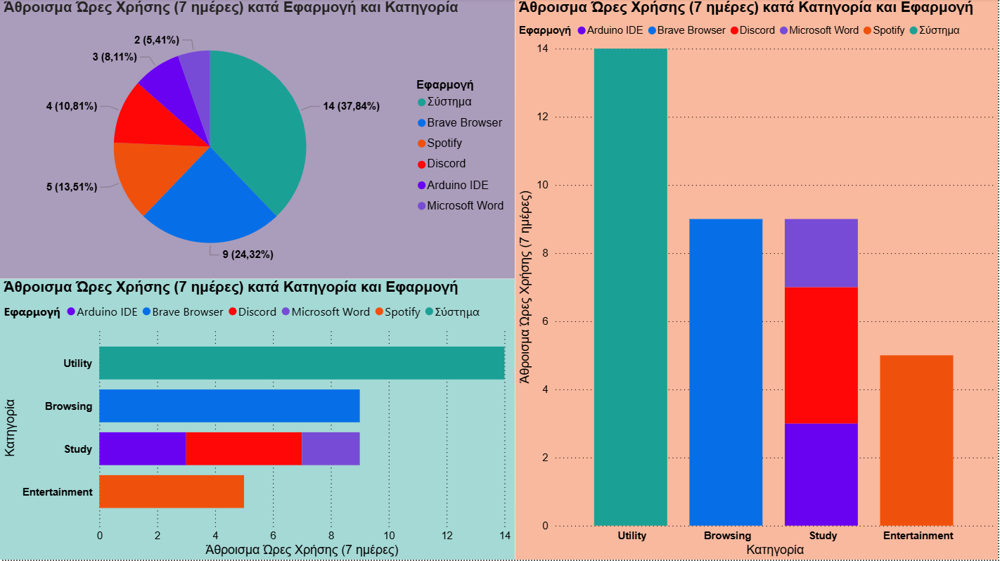

# 📊 Laptop Productivity Analysis

Αυτό είναι το πρώτο μου Data Analysis Project!
Ανάλυσα τη χρήση του Laptop μου για να δω πώς μοιράζω τον χρόνο μου ανάμεσα σε διάβασμα (Study) και διασκέδαση (Entertainment).

### 🛠️ Εργαλεία
* **Excel:** Καταγραφή δεδομένων μπαταρίας/χρόνου.
* **Power BI:** Δημιουργία Dashboard και visualizations.

### 📸 Το Dashboard μου
Δείτε την ανάλυση που έφτιαξα:

